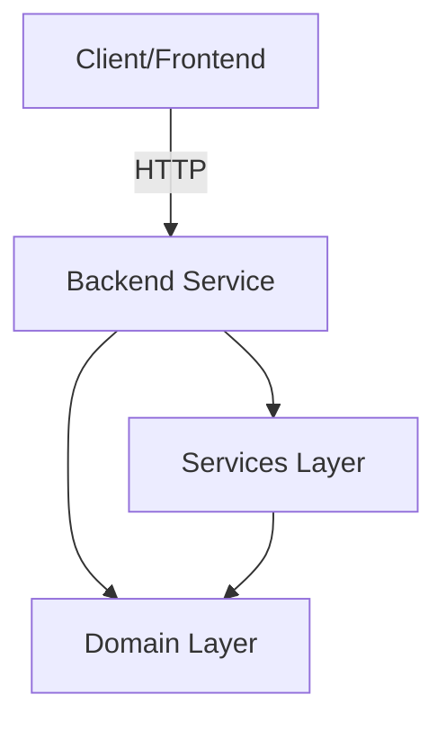
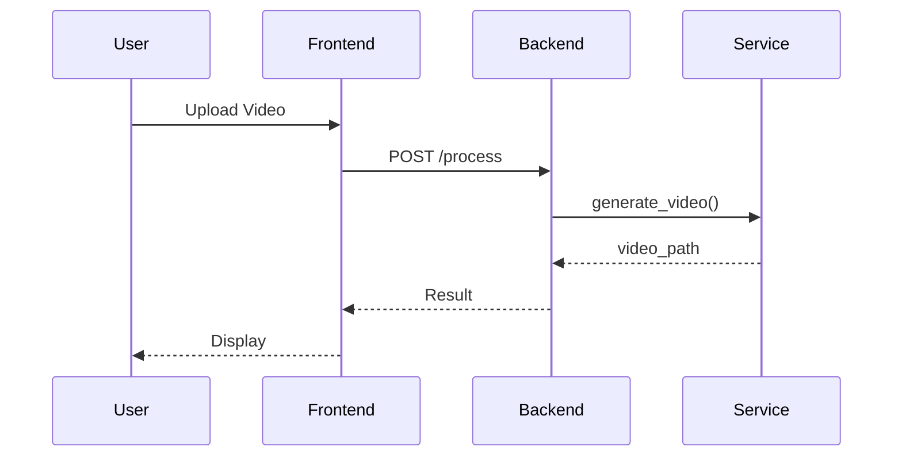
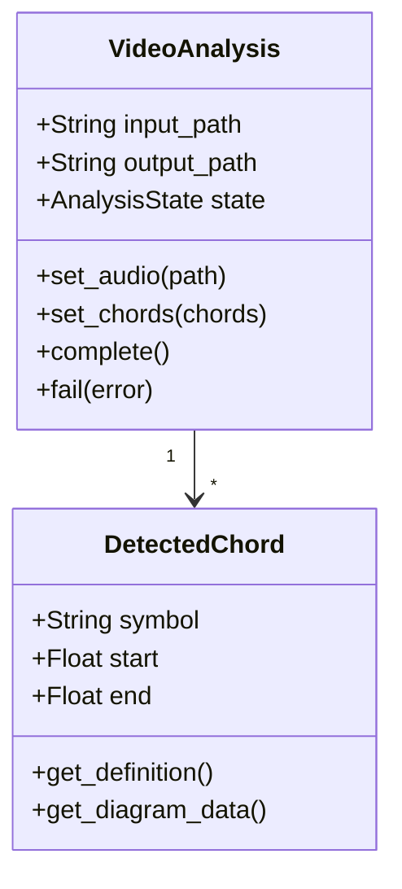
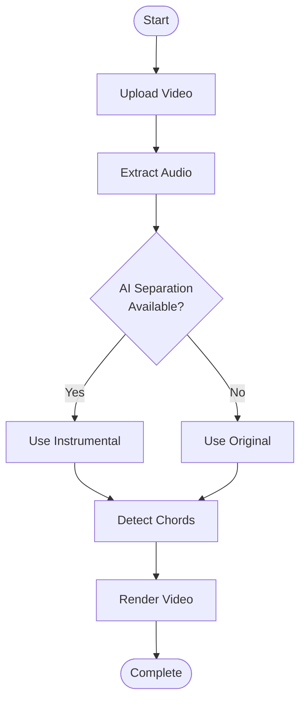
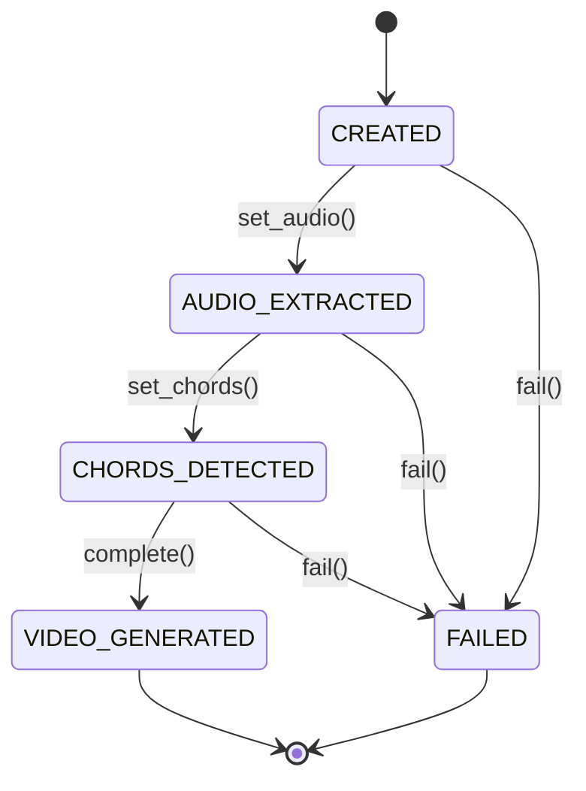

# Documentation Writing Workflow

This workflow guides the creation of high-quality technical documentation for the project using Markdown and Mermaid diagrams.

## 1. Analyze the Component/System
Before writing documentation, thoroughly understand:
- The component's purpose and responsibilities
- Its inputs, outputs, and side effects
- Dependencies and relationships with other components
- Current implementation details
- Edge cases and error handling

## 2. Choose Documentation Type
Select the appropriate documentation format:
- **Architecture Documentation**: System-level overview with component diagrams
- **API Documentation**: Detailed function/class references
- **User Guide**: Step-by-step instructions for end users
- **Developer Guide**: Technical setup and contribution guidelines

## 3. Create Document Structure
Follow this standard structure:

```markdown
# [Title]

## Overview
Brief description (2-3 sentences) of what this document covers.

## Architecture/Design
High-level explanation with Mermaid diagrams.

## Components/Details
Detailed breakdown of key elements.

## Usage/Examples
Practical examples and code snippets.

## Error Handling
Common errors and troubleshooting.

## References
Links to related documentation.
```

## 4. Add Mermaid Diagrams
Use Mermaid diagrams to visualize:

### Architecture Diagrams (C4 or Component diagrams)


### Sequence Diagrams (for workflows)


### Class Diagrams (for domain models)


### Flowcharts (for processes)


### State Diagrams (for state machines)


## 5. Write Clear Code Examples
Include practical, runnable code examples:

```python
# Good: Clear, complete example
from services.pipeline import generate_video
from services.file_manager import FileManager

file_manager = FileManager()
output_path = generate_video(
    input_file="input.mp4",
    file_manager=file_manager
)
print(f"Video generated: {output_path}")
```

## 6. Document Error Cases
Always document common errors and solutions:

```markdown
## Common Errors

### `FileNotFoundError: Audio file not found`
**Cause**: The audio extraction step failed.
**Solution**: Ensure ffmpeg is installed and the input video has an audio track.

### `ValueError: file_manager is required`
**Cause**: Missing dependency injection.
**Solution**: Always pass a FileManager instance to generate_video().
```

## 7. Add Tables for Structured Data
Use tables for parameter documentation:

| Parameter | Type | Required | Description |
|-----------|------|----------|-------------|
| `input_file` | `str` | Yes | Path to input video file |
| `file_manager` | `FileManager` | Yes | File management instance |
| `progress` | `Callable` | No | Progress callback function |

## 8. Review Checklist
Before finalizing documentation:
- [ ] Clear title and overview
- [ ] Mermaid diagrams for complex relationships
- [ ] Code examples are tested and work
- [ ] Error cases documented
- [ ] No Spanish text (all English)
- [ ] Proper markdown formatting
- [ ] Links to related docs work
- [ ] Tables use proper alignment

## 9. File Naming Conventions
- Use lowercase with hyphens: `video-processing-guide.md`
- Place in appropriate directory:
  - `docs/architecture/` - System design
  - `docs/api/` - API references
  - `docs/guides/` - User/developer guides
  - `README.md` - Project overview

## 10. Best Practices
- **Keep it concise**: Aim for clarity over length
- **Use active voice**: "The system processes..." not "The video is processed..."
- **Include diagrams early**: Visual first, then details
- **Update regularly**: Documentation should match current code
- **Link liberally**: Connect related documentation
- **Test examples**: All code should be copy-paste ready
