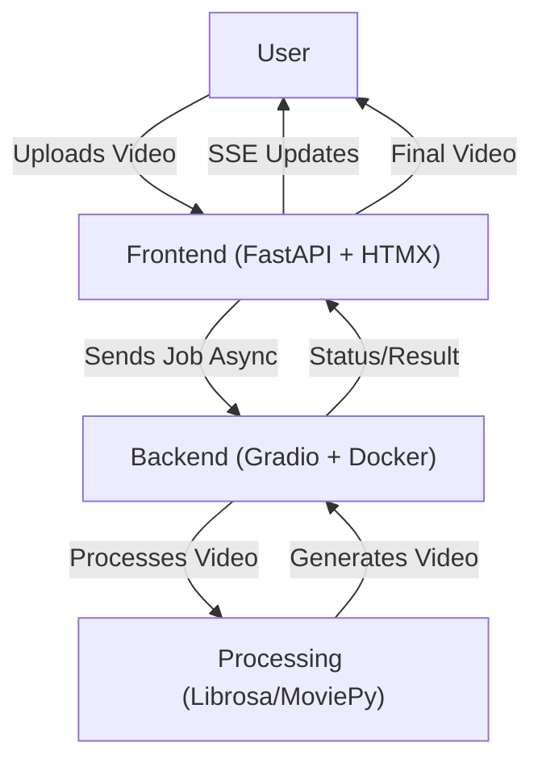

# Musical Note and Chord Extractor

**Doresare** is an AI-powered application that generates ukulele chord video overlays. It automates the process of extracting audio from music videos, detecting chords using AI, and rendering visually synchronized chord diagrams onto the original video.

## Architecture

The system is designed with a decoupled architecture to manage resource-intensive tasks effectively on constrained hardware.

-   **Frontend**: Lightweight user interface for uploads and status monitoring.
-   **Backend**: Heavy processing unit for AI inference and video rendering.

### Component Specifications

#### 1. Frontend
**Technology Stack**:
-   **Framework**: FastAPI (serving Jinja2 templates)
-   **Interactivity**: HTMX + Server-Sent Events (SSE)
-   **Styling**: Tailwind CSS 4

**Key Requirements**:
-   **Smart Validation**: Strict validation for file size and video validity *before* processing to prevent resource exhaustion.
-   **Real-Time Status Tracking**: SSE channels to display Queue Position and granular progress (e.g., "Separating Audio", "Rendering Video").
-   **Future Capabilities**: YouTube URL integration (using `yt-dlp`).

#### 2. Backend
**Technology Stack**:
-   **Framework**: FastAPI (API) + Gradio (Demos/Internal Tools)
-   **Core Libraries**: Librosa, MoviePy, OnnxRuntime, audio-separator

**Key Requirements**:
-   **Processing Pipeline**:
    -   Input: Video Files (and later URLs).
    -   AI Audio Processing: Source separation and chord detection.
    -   Video Generation: Render output with overlaid chord graphics.
-   **Concurrency**: Strict queuing system due to high CPU/GPU usage per task.

### Architecture Diagram



## Non-Functional Requirements & Constraints

### Hardware Constraints
-   **Target Hardware**: Intel J3455 (Low-power Celeron).
-   **Instruction Set Limits**: **NO AVX Support**. AI models and runtime (OnnxRuntime) must be compatible with non-AVX CPUs.
-   **Acceleration**: Must utilize OpenVINO for AI inference and Intel QSV (via ffmpeg/jellyfin-ffmpeg) for video encoding where possible.

### Performance & UX
-   **Long-Running Processes**: Processing times can be significant. The UI must keep the user engaged or informed.
-   **Stability**: The backend must handle timeouts and failures gracefully without leaking resources.

## Project Structure

*   `backend/`: Processing server code (Gradio).
*   `frontend/`: Web interface code (FastAPI).

## Local Execution

### Prerequisites

*   Python 3.10+
*   `uv` (Package Manager)
*   `ffmpeg` installed on the system.

### Backend

```bash
cd backend
uv sync
uv run app.py
```
The backend will run at `http://localhost:7860`.

### Frontend

```bash
cd frontend
uv sync
uv run uvicorn main:app --reload
```
The frontend will run at `http://localhost:8000`.

## Deployment on AWS EC2 (Free Tier)

This project can be deployed on an AWS EC2 instance (e.g., t2.micro or t3.micro) using Docker Compose.

### Prerequisites
1.  **AWS Account**: Create a free account at [aws.amazon.com](https://aws.amazon.com/).
2.  **EC2 Instance**: Launch an instance with:
    *   **AMI**: Ubuntu Server 24.04 LTS (or similar).
    *   **Instance Type**: `t2.micro` or `t3.micro` (Free Tier eligible).
    *   **Security Group**: Allow Inbound traffic on ports `22` (SSH) and `80` (HTTP).

### Installation Steps

1.  **SSH into your instance**:
    ```bash
    ssh -i "your-key.pem" ubuntu@your-ec2-public-ip
    ```

2.  **Install Docker & Docker Compose**:
    ```bash
    # Add Docker's official GPG key:
    sudo apt-get update
    sudo apt-get install ca-certificates curl
    sudo install -m 0755 -d /etc/apt/keyrings
    sudo curl -fsSL https://download.docker.com/linux/ubuntu/gpg -o /etc/apt/keyrings/docker.asc
    sudo chmod a+r /etc/apt/keyrings/docker.asc

    # Add the repository to Apt sources:
    echo \
      "deb [arch=$(dpkg --print-architecture) signed-by=/etc/apt/keyrings/docker.asc] https://download.docker.com/linux/ubuntu \
      $(. /etc/os-release && echo "$VERSION_CODENAME") stable" | \
      sudo tee /etc/apt/sources.list.d/docker.list > /dev/null
    sudo apt-get update

    # Install Docker packages:
    sudo apt-get install -y docker-ce docker-ce-cli containerd.io docker-buildx-plugin docker-compose-plugin
    ```

3.  **Clone the repository**:
    ```bash
    git clone https://github.com/olidroide/doresare.git
    cd doresare
    ```

### Running the Application

#### Option A: Production (Frontend + Nginx only)
Use this option if the Backend is deployed separately (e.g., on Hugging Face Spaces).

1.  **Configure Environment**:
    Edit `docker-compose.prod.yml` to set your Hugging Face Space URL or Token:
    ```yaml
    environment:
      - HF_SPACE=your-username/your-space
      - HF_TOKEN=your-hf-token
    ```

2.  **Run with Docker Compose**:
    ```bash
    sudo docker compose -f docker-compose.prod.yml up -d --build
    ```

#### Option B: Development (Full Stack)
Use this option to run everything (Backend + Frontend + Nginx) on the EC2 instance (requires more resources, might exceed Free Tier limits if heavy processing occurs).

1.  **Run with Docker Compose**:
    ```bash
    sudo docker compose -f docker-compose.dev.yml up -d --build
    ```

5.  **Access the Application**:
    Open your browser and navigate to `http://your-ec2-public-ip`.

### Architecture
- **Nginx**: Reverse proxy listening on port 80.
- **Frontend**: FastAPI app serving the UI (internal port 8000).
- **Backend**: (In Dev mode) FastAPI/Gradio app processing videos (internal port 7860).
